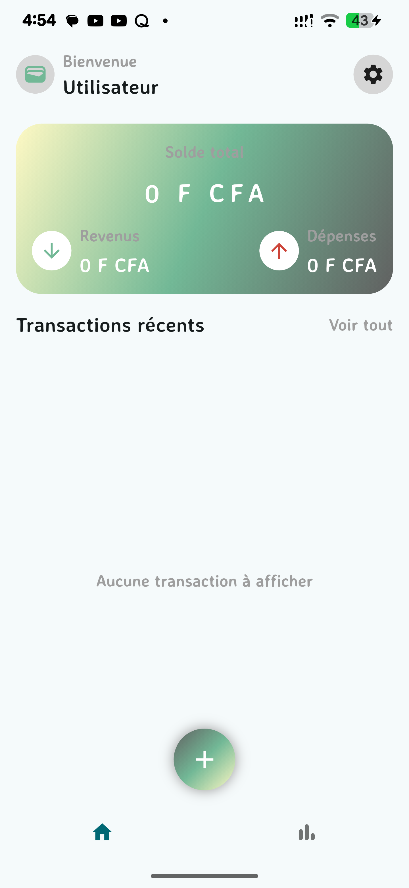
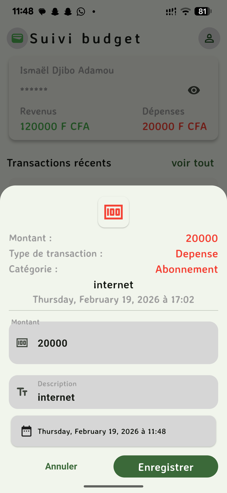

# suivi_budget

**Branch actuelle :** local-storage 

Cette version de l'application privilégie la confidentialité et la rapidité en stockant 100% des données sur l'appareil de l'utilisateur.

- **Moteur :** Supabase AUTH & DATABASE .

## Fonctionnalités :

## Authentification
- Authentification locale à l'ouverture de l'app.

## Gestion des Transactions
- **Opérations CRUD :** Enregistrement, modification et suppression et lecture des revenus et dépenses avec persistance immédiate.
- **Filtrage Dynamique :** Système de tri sur l'écran d'accueil pour isoler les flux financiers.
- **Calcul Automatique :** Mise à jour instantanée du solde global.

## Technologies utilisées 
- **Framework:** Flutter
- **Backend:** Floor, Sqflite
- **Gestion d'etat:** Provider

## Aperçu 
 |  |  |  |  | 

## Prochaines Étapes

- **Analyses graphiques :** Ajout de diagrammes pour visualiser les catégories de transactions.
- **Export PDF :** Génération de rapports.
- **Refonte UI :** Passage à un design plus moderne et support du Dark Mode.

