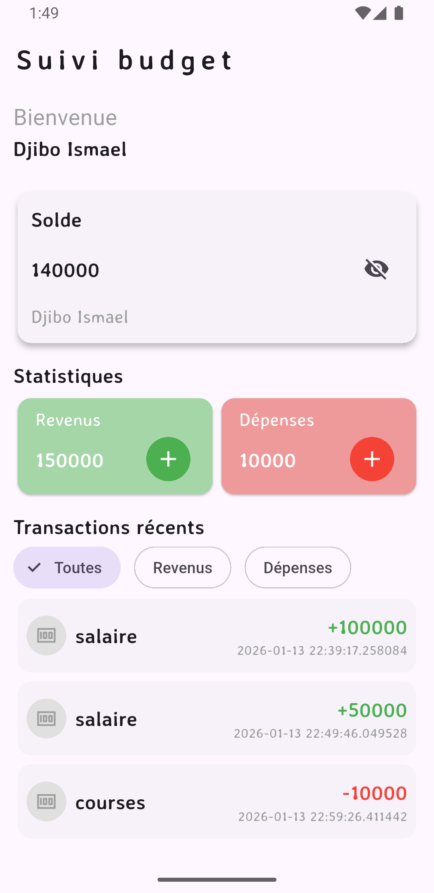

# suivi_budget

Ce projet est une mini application de suivi budget pour jeune actif

## Fonctionnalités :

- **Onboarding:** Enregistrement du nom de l'utilisateur avec stockage permanent.
- **Gestion et Suivi des transactions:** Enregistrement et affichage des revenus, dépenses et calcul de solde en temps réel.
- **Persistance des données:** Enregistrement stockage des données légères avec **Shared_Preferences** et l'utilisation de **sqflite** pour le stockage des données de transactions.
- **Gestion d'État Réactive:** Mise à jour instantanée de l'interface utilisateur lors de l'ajout d'informations sans recharger la page.
- **Filtrage des transaction** sur l'écran d'accueil

## Statut de l'application :

Ce projet est MVP et est évolutif au fil du temps

- Front-End (UI/UX) Complet Le design et la mise en page sont finalisés et réactifs pour un MVP.
- Logique d'enregistrement des revenus et dépenses  complet pour un MVP.
- Déploiement Non applicable, Projet personnel, non destiné à au public.

## Objectif de ce projet :

L'objectif est de créer une application mobile de gestion de finances personnelles permettant à l'utilisateur de suivre ses transactions quotidiennes tout en personnalisant son expérience. L'accent est mis sur la persistance locale (les données restent dans le téléphone) et la réactivité de l'interface.

## Aperçu du design

## Technologies utilisées 

- **Framework:** Flutter
- **Langage:** Dart
- **UI:** TextField, Card, Text, ModalBottomSheet, Icon, FilledButton, IconButton...
- **Dépendences:** Provider, SharedPreferences, Sqflite, Floor, GoogleFonts....

## Prochaines Étapes

- Ajout de plusieurs autres fonctionnalités avancées ()
- Amélioration du design

