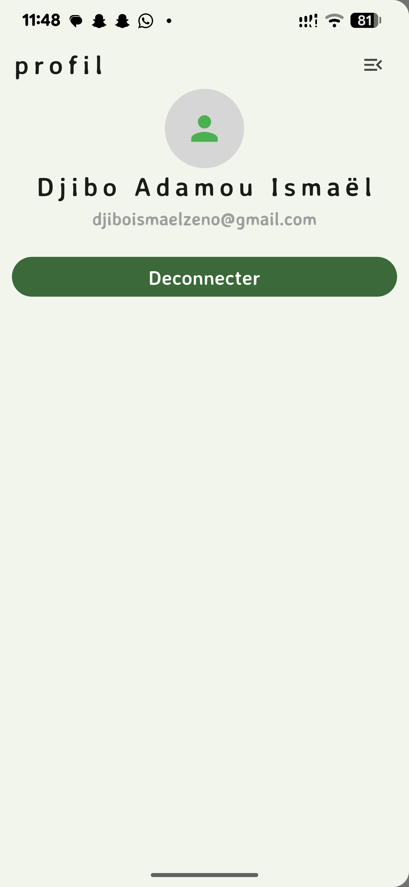
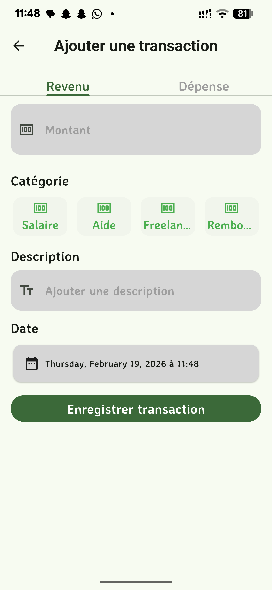
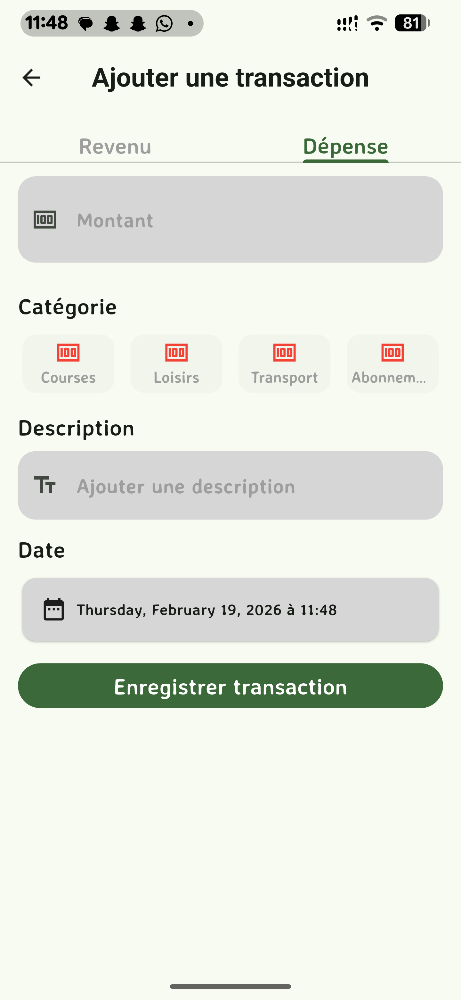
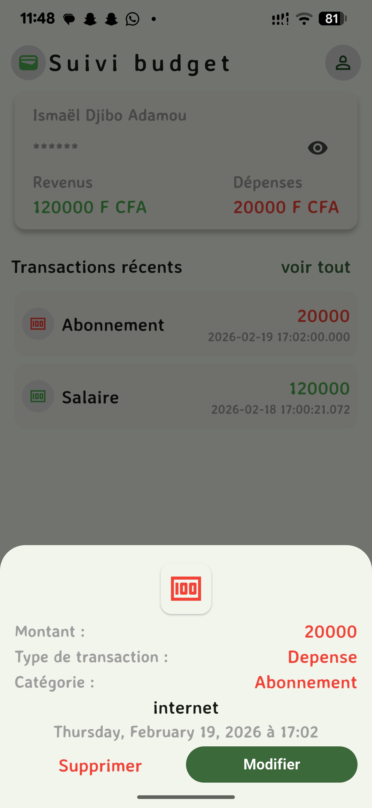

# suivi_budget

**Branch actuelle :** backend-supabase

cette version de l'application privilégie la synchronisation et la sécurité.

- **Moteur :** Supabase AUTH & DATABASE .

## Fonctionnalités :

## Authentification
- Création de compte et connexion sécurisée via Supabase AUTH.

## Gestion des Transactions
- **Opérations CRUD :** Enregistrement, modification et suppression et lecture des revenus et dépenses.
- **Calcul Automatique :** Mise à jour instantanée du solde global.

## Stockage des Données
- **DATABASE :** Synchronisation des transactions et des profils utilisateurs sur le cloud.
- **Cache local :** Utilisation de SharedPreferences pour les préférences légères.

## Technologies utilisées 
- **Framework:** Flutter
- **Backend:** Supabase AUTH, DATABASE 
- **Gestion d'etat:** Provider

## Aperçu 
 |  |  |  |  | 

## Prochaines Étapes

- **Analyses graphiques :** Ajout de diagrammes pour visualiser les catégories de transactions.
- **Export PDF :** Génération de rapports.
- **Refonte UI :** Passage à un design plus moderne et support du Dark Mode.

